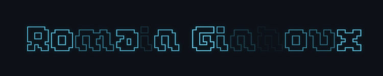
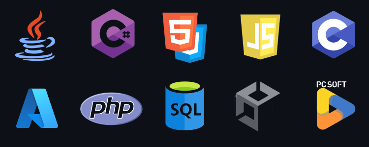

  

---

## 👨‍💻 About Me

I'm a **full-stack developer** with a passion for **coding**, **creation**, and the **digital world**.  
I combine strong technical skills with human-centered experiences to bring meaningful projects to life.

🧠 From **psychology** to **computer science**, with a stop in **research**, I've always embraced a curious and creative mindset.

💡 Self-taught and resourceful, I love learning new technologies and taking on fresh challenges.

  

## 🛠️ Tech Stack

  

- Languages: **Java**, **C#**, **HTML/CSS**, **JavaScript**, **PHP**, **C**
- Databases: **SQL**
- Tools: **Unity3D**, **Power BI**, **Office 365**, **Git**
- Cloud & Infra: **Azure**
- Design: **Adobe After Effects**, **Premiere Pro**
- Environment: **PCSoft**, **Visual Studio**, **FL Studio**

---

## 🧪 Professional Experience

- 💼 **Intern Developer** at *Faure Transport* (2024)
- 🧠 **Research Collaborator** – Subtitle study at UGA (2023)
- 🌍 **Humanitarian Volunteer** in **Cameroon** & **Senegal**
  - Academic, social, and entrepreneurial support

---

## 🎓 Education

- 🎓 Master’s in Computer Science & Social Sciences (UGA Grenoble)
- 🧠 M1 & Bachelor’s in Clinical Psychology (UGA Grenoble)
- 📐 MPSI Preparatory Classes (La Martinière, Lyon)
- 🎓 Science Baccalaureate, Engineering Sciences – *With honors*

---

## 🎨 Interests

- 🎧 **Music production** & **Sound design**
- 🎮 **Video game development**
- 🎬 **Motion design / VFX**
- 🏓 **Table tennis** & **Tennis**
- 🌱 **Continuous learning via MOOCs**

---

## 🌐 Website

🔗 [romainginhoux.fr](https://www.romainginhoux.fr)

---

## 📬 Contact

📧 [romainginhoux@gmail.com](mailto:romainginhoux@gmail.com)  
📞 +33 6 95 64 44 29  
📍 Assieu, France  
📄 [View my CV](./CV.pdf)

---

  

<i>Thanks for stopping by! This little monkey is working hard to learn more every day 🐒💻</i>

